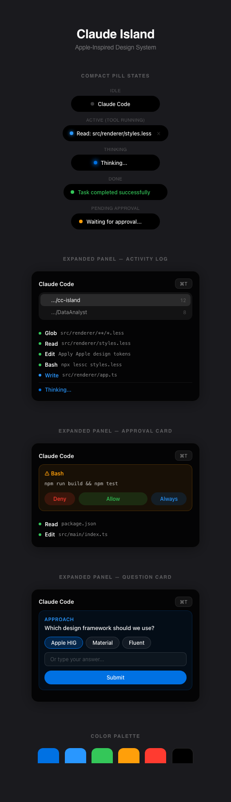

**English** | [中文](./README.zh-CN.md)

# CCIsland

CCIsland is a Dynamic Island for Claude Code on macOS and Windows — displays real-time execution progress and approval actions from your terminal Claude Code session as a floating island at the top of your screen.


<p align="center">
  
</p>

<p align="center">
  
</p>

---

## Features

| Feature | Description |
|---------|-------------|
| Apple Design | Apple-inspired UI — SF Pro typography, glass blur, Apple Blue accent |
| Tool Progress | Real-time display of file operations and command execution |
| Approval Requests | Three-option permission decisions: Allow / Deny / Always |
| Question Cards | Answer AskUserQuestion directly in the island UI |
| Multi-Session | Track multiple concurrent sessions, auto-focus the most active |
| Terminal Jump | ⌘T to jump back to the running terminal window |
| Timeout Recovery | Auto-detect and recover from stale sessions caused by API errors |

Runs entirely **without stealing focus**.

---

## How It Works


Claude Code's [HTTP Hooks](https://docs.anthropic.com/en/docs/claude-code/hooks) POST events to `localhost:51515`. For `PermissionRequest` events, the HTTP connection blocks until the user makes a decision in the island UI — achieving **synchronous approval blocking**.

---

## Quick Start

### Prerequisites

- macOS 14 (Sonoma) or later, or Windows 10+
- Claude Code CLI installed

### Install

**macOS one-line install (recommended)**

```bash
curl -fsSL https://raw.githubusercontent.com/colna/CCIsland/main/install.sh | bash
```

Auto-detects CPU architecture (Apple Silicon / Intel) and installs to `/Applications`.

**Manual download**

Go to [Releases](https://github.com/colna/CCIsland/releases) and download the package for your platform:

- macOS: `.dmg` or `.app.tar.gz`
- Windows: `.msi` or `.exe` (NSIS installer)

Current Windows support is focused on basic runtime compatibility. Some macOS-specific behavior, such as terminal jump, is unavailable on Windows.

**Build from source**

```bash
git clone https://github.com/colna/CCIsland.git
cd CCIsland
pnpm install
pnpm tauri:dev
```

> Requires [Rust toolchain](https://rustup.rs/) and [Tauri v2 prerequisites](https://v2.tauri.app/start/prerequisites/).

### Setup Hooks

**Option 1: Tray menu (recommended)**

Click the tray icon → `Setup Hooks` after launch. Hooks are automatically written to `~/.claude/settings.json`.

**Option 2: Manual config**

Edit `~/.claude/settings.json`:

```json
{
  "hooks": {
    "UserPromptSubmit": [
      { "type": "http", "url": "http://localhost:51515/hook" }
    ],
    "PreToolUse": [
      { "type": "http", "url": "http://localhost:51515/hook" }
    ],
    "PostToolUse": [
      { "type": "http", "url": "http://localhost:51515/hook" }
    ],
    "Notification": [
      { "type": "http", "url": "http://localhost:51515/hook" }
    ],
    "Stop": [
      { "type": "http", "url": "http://localhost:51515/hook" }
    ]
  }
}
```

**Remove hooks:** Tray icon → `Remove Hooks`

---

## Panel States

| State | Description | Trigger |
|-------|-------------|---------|
| **Hidden** | Invisible | No active session |
| **Compact** | Pill capsule | Tool use, Thinking, Done |
| **Expanded** | Full panel | Approval request, Question card, or click the pill |

---

## Project Structure

```
src-tauri/                       # Tauri / Rust backend
├── src/
│   ├── main.rs                  # App entry + Tauri commands
│   ├── hook_server.rs           # Axum HTTP server (:51515)
│   ├── hook_router.rs           # Event dispatcher + session state
│   ├── approval_manager.rs      # Async oneshot approval blocking
│   ├── window_state.rs          # Tri-state window controller
│   ├── hook_installer.rs        # Hook install/uninstall
│   ├── tray.rs                  # System tray (dynamic icon)
│   └── shared_types.rs          # Shared type definitions
├── Cargo.toml                   # Rust dependencies
└── tauri.conf.json              # Tauri window & bundle config
src/
├── renderer/                    # Frontend (WebView)
│   ├── index.html               # Pill + panel layout
│   ├── styles.less              # Apple design system (Less)
│   ├── app.ts                   # UI logic
│   └── tauri-bridge.ts          # @tauri-apps/api bridge
├── shared/
│   ├── types.ts                 # Type definitions
│   └── tool-description.ts      # Tool description generator
```

---

## Build & Release

```bash
# Dev mode
pnpm tauri:dev

# Package current platform
pnpm tauri:build
```

---

## Tech Stack

| Tech | Usage |
|------|-------|
| Tauri v2 | Window management, tray, IPC, bundling |
| Rust (2021 edition) | Backend — hook server, approval blocking, session state |
| Axum + Tokio | Async HTTP server & runtime |
| TypeScript 5.5 | Frontend type safety |
| Less | Style preprocessing |
| @tauri-apps/api | Frontend ↔ backend bridge |

## License

MIT
