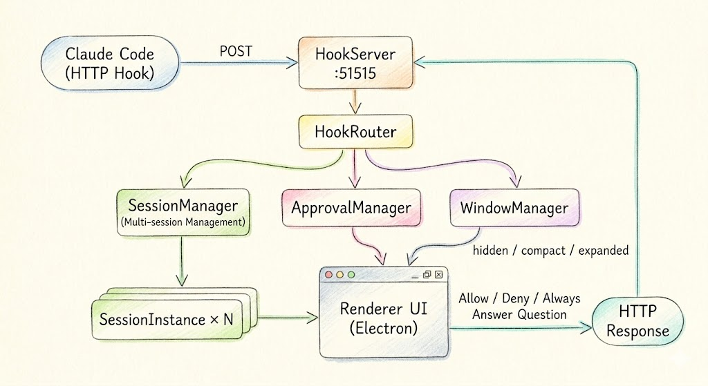

[English](./README.md) | **中文**

# CCIsland

CCIsland 是 macOS 和 Windows 上的 Claude Code 灵动岛 —— 在屏幕顶部以悬浮岛的形式，实时展示终端中 Claude Code 的执行进度和审批操作。


<p align="center">
  
</p>

<p align="center">
  
</p>

---

## 功能特性

| 功能 | 描述 |
|------|------|
| Apple 设计 | Apple 风格 UI —— SF Pro 字体、毛玻璃模糊、Apple Blue 强调色 |
| 工具进度 | 实时展示文件操作和命令执行状态 |
| 审批请求 | 三选一权限决策：允许 / 拒绝 / 始终允许 |
| 问题卡片 | 直接在灵动岛 UI 中回答 AskUserQuestion |
| 多会话 | 追踪多个并发会话，自动聚焦最活跃的会话 |
| 终端跳转 | ⌘T 快速跳转到正在运行的终端窗口 |
| 超时恢复 | 自动检测并恢复因 API 错误导致的卡死会话 |

全程**不抢占焦点**运行。

---

## 工作原理



Claude Code 的 [HTTP Hooks](https://docs.anthropic.com/en/docs/claude-code/hooks) 将事件 POST 到 `localhost:51515`。对于 `PermissionRequest` 事件，HTTP 连接会阻塞等待用户在灵动岛 UI 中做出决策 —— 实现**同步审批阻塞**。

---

## 快速开始

### 前置条件

- macOS 14 (Sonoma) 或更高版本，或 Windows 10+
- 已安装 Claude Code CLI

### 安装

**macOS 一键安装（推荐）**

```bash
curl -fsSL https://raw.githubusercontent.com/colna/CCIsland/main/install.sh | bash
```

自动检测 CPU 架构（Apple Silicon / Intel），安装到 `/Applications`。

**手动下载**

前往 [Releases](https://github.com/colna/CCIsland/releases) 下载对应平台的安装包：

- macOS: `.dmg` 或 `.app.tar.gz`
- Windows: `.msi` 或 `.exe`（NSIS 安装器）

当前 Windows 支持以基本运行兼容为主。部分 macOS 特有功能（如终端跳转）在 Windows 上不可用。

**从源码构建**

```bash
git clone https://github.com/colna/CCIsland.git
cd CCIsland
pnpm install
pnpm tauri:dev
```

> 需要 [Rust 工具链](https://rustup.rs/) 和 [Tauri v2 前置依赖](https://v2.tauri.app/start/prerequisites/)。

### 配置 Hooks

**方式一：托盘菜单（推荐）**

启动后点击托盘图标 → `Setup Hooks`。Hooks 会自动写入 `~/.claude/settings.json`。

**方式二：手动配置**

编辑 `~/.claude/settings.json`：

```json
{
  "hooks": {
    "UserPromptSubmit": [
      { "type": "http", "url": "http://localhost:51515/hook" }
    ],
    "PreToolUse": [
      { "type": "http", "url": "http://localhost:51515/hook" }
    ],
    "PostToolUse": [
      { "type": "http", "url": "http://localhost:51515/hook" }
    ],
    "Notification": [
      { "type": "http", "url": "http://localhost:51515/hook" }
    ],
    "Stop": [
      { "type": "http", "url": "http://localhost:51515/hook" }
    ]
  }
}
```

**移除 Hooks：** 托盘图标 → `Remove Hooks`

---

## 面板状态

| 状态 | 描述 | 触发条件 |
|------|------|----------|
| **隐藏** | 不可见 | 无活跃会话 |
| **紧凑** | 药丸胶囊 | 工具使用、思考中、完成 |
| **展开** | 完整面板 | 审批请求、问题卡片，或点击药丸 |

---

## 项目结构

```
src-tauri/                       # Tauri / Rust 后端
├── src/
│   ├── main.rs                  # 应用入口 + Tauri 命令
│   ├── hook_server.rs           # Axum HTTP 服务器 (:51515)
│   ├── hook_router.rs           # 事件分发器 + 会话状态
│   ├── approval_manager.rs      # 异步 oneshot 审批阻塞
│   ├── window_state.rs          # 三态窗口控制器
│   ├── hook_installer.rs        # Hook 安装/卸载
│   ├── tray.rs                  # 系统托盘（动态图标）
│   └── shared_types.rs          # 共享类型定义
├── Cargo.toml                   # Rust 依赖
└── tauri.conf.json              # Tauri 窗口与打包配置
src/
├── renderer/                    # 前端（WebView）
│   ├── index.html               # 药丸 + 面板布局
│   ├── styles.less              # Apple 设计系统（Less）
│   ├── app.ts                   # UI 逻辑
│   └── tauri-bridge.ts          # @tauri-apps/api 桥接
├── shared/
│   ├── types.ts                 # 类型定义
│   └── tool-description.ts      # 工具描述生成器
```

---

## 构建与发布

```bash
# 开发模式
pnpm tauri:dev

# 打包当前平台
pnpm tauri:build
```

---

## 技术栈

| 技术 | 用途 |
|------|------|
| Tauri v2 | 窗口管理、托盘、IPC、打包 |
| Rust (2021 edition) | 后端 —— Hook 服务器、审批阻塞、会话状态 |
| Axum + Tokio | 异步 HTTP 服务器与运行时 |
| TypeScript 5.5 | 前端类型安全 |
| Less | 样式预处理 |
| @tauri-apps/api | 前端 ↔ 后端桥接 |

## 许可证

MIT
