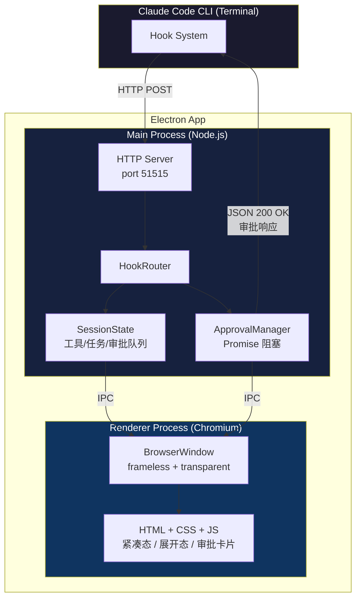
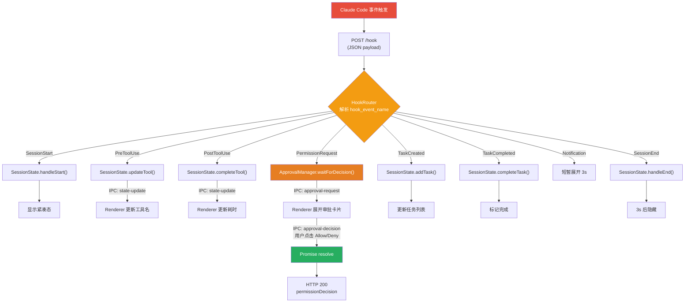
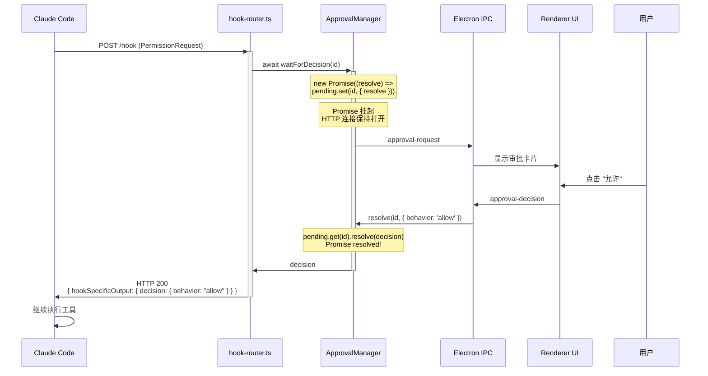

# Claude Island — JavaScript/Electron 技术方案

> 纯 JS/TS 实现，基于 Electron，无需 Xcode。

---

## 1. 方案对比：Swift vs Electron

| 维度 | Swift (NSPanel) | Electron (JS/TS) |
|------|----------------|-------------------|
| 开发语言 | Swift | TypeScript / HTML / CSS |
| 开发工具 | Xcode | VS Code / 任意编辑器 |
| 包体积 | ~5MB | ~150MB (Electron 运行时) |
| 内存占用 | ~20MB | ~80-120MB |
| 窗口控制 | NSPanel 原生 | BrowserWindow (Chromium) |
| 刘海适配 | NSScreen.safeAreaInsets | screen.getDisplay() + 计算 |
| 不抢焦点 | `.nonactivatingPanel` | `focusable: false` + `alwaysOnTop` |
| HTTP 服务 | FlyingFox (第三方) | Node.js 内置 `http` 模块 |
| 上手难度 | 中等 (Swift + AppKit) | **低 (纯前端技术栈)** |
| 审批阻塞 | CheckedContinuation | **Promise + resolve** |
| 打包分发 | .app (原生) | .dmg (electron-builder) |

**结论**：如果团队更熟悉 JS/TS 前端技术栈，Electron 方案开发效率更高，功能完全等价。

---

## 2. 核心架构

### 2.1 整体架构图



### 2.2 数据流



---

## 3. 技术选型

| 组件 | 选择 | 说明 |
|------|------|------|
| 框架 | **Electron 33+** | 桌面应用框架，支持无边框透明窗口 |
| 语言 | **TypeScript** | 类型安全 |
| HTTP 服务 | **Node.js 内置 `http`** | 零依赖，Main Process 中运行 |
| UI | **HTML + CSS + 原生 JS** 或 **React/Vue** | 灵动岛 UI 简单，原生 JS 即可 |
| 打包 | **electron-builder** | 生成 .dmg / .app |
| 进程通信 | **Electron IPC** | Main ↔ Renderer 通信 |

---

## 4. 项目结构

```
claude-island/
├── package.json
├── tsconfig.json
├── electron-builder.yml
│
├── src/
│   ├── main/                          # Main Process (Node.js)
│   │   ├── index.ts                   # 入口: 创建窗口 + 启动服务
│   │   ├── hook-server.ts             # HTTP 服务, 接收 Claude Code hooks
│   │   ├── hook-router.ts             # 事件路由 + 响应构建
│   │   ├── approval-manager.ts        # Promise 阻塞式审批
│   │   ├── session-state.ts           # 会话状态管理
│   │   ├── window-manager.ts          # 灵动岛窗口定位 + 展开/收起
│   │   ├── tray.ts                    # 系统托盘图标 + 菜单
│   │   ├── hook-installer.ts          # 读写 ~/.claude/settings.json
│   │   └── ipc-handlers.ts            # IPC 消息处理
│   │
│   ├── renderer/                      # Renderer Process (Chromium)
│   │   ├── index.html                 # 主页面
│   │   ├── styles.css                 # 灵动岛样式 (深色主题)
│   │   ├── app.ts                     # UI 逻辑
│   │   ├── components/
│   │   │   ├── compact-view.ts        # 紧凑态 (药丸)
│   │   │   ├── expanded-view.ts       # 展开态 (面板)
│   │   │   ├── approval-card.ts       # 审批卡片
│   │   │   ├── task-list.ts           # 任务列表
│   │   │   └── tool-row.ts            # 工具历史行
│   │   └── animations.ts             # 展开/收起动画
│   │
│   └── shared/
│       └── types.ts                   # 共享类型定义
│
├── assets/
│   ├── icon.png                       # App 图标
│   └── tray-icon.png                  # 托盘图标 (16x16)
│
└── scripts/
    └── install-hooks.ts               # CLI: 安装 hooks 到 settings.json
```

---

## 5. 核心模块实现

### 5.1 入口 — `src/main/index.ts`

```typescript
import { app, BrowserWindow, Tray, screen, ipcMain } from 'electron';
import { HookServer } from './hook-server';
import { WindowManager } from './window-manager';
import { SessionState } from './session-state';
import { ApprovalManager } from './approval-manager';
import { setupIPC } from './ipc-handlers';
import { createTray } from './tray';

let mainWindow: BrowserWindow;
let tray: Tray;

const sessionState = new SessionState();
const approvalManager = new ApprovalManager();
const windowManager = new WindowManager();

app.whenReady().then(async () => {
  // 隐藏 Dock 图标 (纯菜单栏 App)
  app.dock?.hide();

  // 创建灵动岛窗口
  mainWindow = createIslandWindow();
  windowManager.setWindow(mainWindow);

  // 系统托盘
  tray = createTray(mainWindow, sessionState);

  // IPC 通信
  setupIPC(ipcMain, approvalManager, sessionState, windowManager);

  // 启动 HTTP Hook 服务
  const server = new HookServer(sessionState, approvalManager, windowManager);
  await server.start(51515);

  console.log('Claude Island running on port 51515');
});

function createIslandWindow(): BrowserWindow {
  const display = screen.getPrimaryDisplay();
  const { width: screenWidth } = display.workAreaSize;

  const win = new BrowserWindow({
    width: 220,
    height: 36,
    x: Math.round(screenWidth / 2 - 110),
    y: 0,  // 屏幕顶部, 后续精确计算

    // 关键: 无边框 + 透明 + 不抢焦点
    frame: false,
    transparent: true,
    hasShadow: true,
    alwaysOnTop: true,
    focusable: false,         // 不抢焦点!
    skipTaskbar: true,
    resizable: false,
    movable: false,
    show: false,              // 初始隐藏, 等待 SessionStart

    // 允许点击穿透空白区域
    webPreferences: {
      preload: `${__dirname}/../renderer/preload.js`,
      contextIsolation: true,
      nodeIntegration: false,
    },
  });

  win.loadFile('src/renderer/index.html');

  // macOS: 所有桌面空间可见
  win.setVisibleOnAllWorkspaces(true, { visibleOnFullScreen: true });

  return win;
}

// 防止 App 完全退出
app.on('window-all-closed', (e: Event) => e.preventDefault());
```

### 5.2 HTTP Hook 服务 — `src/main/hook-server.ts`

```typescript
import http from 'node:http';
import { HookRouter } from './hook-router';
import { SessionState } from './session-state';
import { ApprovalManager } from './approval-manager';
import { WindowManager } from './window-manager';

export class HookServer {
  private server: http.Server | null = null;
  private router: HookRouter;

  constructor(
    sessionState: SessionState,
    approvalManager: ApprovalManager,
    windowManager: WindowManager
  ) {
    this.router = new HookRouter(sessionState, approvalManager, windowManager);
  }

  async start(port: number): Promise<void> {
    this.server = http.createServer(async (req, res) => {
      // 健康检查
      if (req.method === 'GET' && req.url === '/health') {
        res.writeHead(200, { 'Content-Type': 'application/json' });
        res.end('{"status":"ok"}');
        return;
      }

      // Hook 事件入口
      if (req.method === 'POST' && req.url === '/hook') {
        let body = '';
        req.on('data', (chunk) => (body += chunk));
        req.on('end', async () => {
          try {
            const event = JSON.parse(body);
            const response = await this.router.handle(event);
            res.writeHead(200, { 'Content-Type': 'application/json' });
            res.end(JSON.stringify(response));
          } catch (err) {
            res.writeHead(400);
            res.end('{"error":"Invalid JSON"}');
          }
        });
        return;
      }

      res.writeHead(404);
      res.end();
    });

    return new Promise((resolve) => {
      this.server!.listen(port, '127.0.0.1', () => resolve());
    });
  }

  stop(): void {
    this.server?.close();
  }
}
```

### 5.3 事件路由 — `src/main/hook-router.ts`

```typescript
import type { HookEvent, HookResponse } from '../shared/types';
import { SessionState } from './session-state';
import { ApprovalManager } from './approval-manager';
import { WindowManager } from './window-manager';

export class HookRouter {
  constructor(
    private sessionState: SessionState,
    private approvalManager: ApprovalManager,
    private windowManager: WindowManager
  ) {}

  async handle(event: HookEvent): Promise<HookResponse> {
    const { hook_event_name } = event;

    // 更新窗口展开状态
    this.windowManager.onEvent(event, this.approvalManager);

    switch (hook_event_name) {
      case 'SessionStart':
        this.sessionState.handleSessionStart(event);
        this.windowManager.show('compact');
        return {};

      case 'PreToolUse':
        this.sessionState.handlePreToolUse(event);
        // 通知 Renderer 更新 UI
        this.windowManager.sendToRenderer('state-update',
          this.sessionState.getSnapshot());
        return {};

      case 'PostToolUse':
        this.sessionState.handlePostToolUse(event);
        this.windowManager.sendToRenderer('state-update',
          this.sessionState.getSnapshot());
        return {};

      case 'PermissionRequest': {
        // 核心: 阻塞等待用户审批
        this.sessionState.handlePermissionRequest(event);
        this.windowManager.show('expanded');
        this.windowManager.sendToRenderer('approval-request', {
          id: event.tool_use_id,
          toolName: event.tool_name,
          toolInput: event.tool_input,
          description: this.describeToolInput(event),
        });

        // Promise 挂起, 等待用户点击
        const decision = await this.approvalManager.waitForDecision(
          event.tool_use_id!
        );

        return this.buildPermissionResponse(decision);
      }

      case 'TaskCreated':
        this.sessionState.handleTaskCreated(event);
        this.windowManager.sendToRenderer('state-update',
          this.sessionState.getSnapshot());
        return {};

      case 'TaskCompleted':
        this.sessionState.handleTaskCompleted(event);
        this.windowManager.sendToRenderer('state-update',
          this.sessionState.getSnapshot());
        return {};

      case 'Notification':
        this.sessionState.handleNotification(event);
        this.windowManager.show('expanded');
        this.windowManager.sendToRenderer('notification',
          { message: event.notification_message });
        // 3 秒后自动收起
        setTimeout(() => this.windowManager.show('compact'), 3000);
        return {};

      case 'SessionEnd':
      case 'Stop':
        this.sessionState.handleSessionEnd(event);
        this.windowManager.sendToRenderer('state-update',
          this.sessionState.getSnapshot());
        setTimeout(() => this.windowManager.hide(), 3000);
        return {};

      default:
        return {};
    }
  }

  private buildPermissionResponse(
    decision: { behavior: 'allow' | 'deny'; reason?: string }
  ): HookResponse {
    return {
      hookSpecificOutput: {
        hookEventName: 'PermissionRequest',
        decision: {
          behavior: decision.behavior,
          ...(decision.reason ? { message: decision.reason } : {}),
          interrupt: false,
        },
      },
    };
  }

  private describeToolInput(event: HookEvent): string {
    const input = event.tool_input || {};
    switch (event.tool_name) {
      case 'Bash':
        return input.command || 'shell command';
      case 'Read':
        return input.file_path || 'file';
      case 'Write':
        return input.file_path || 'file';
      case 'Edit':
        return input.file_path || 'file';
      case 'Glob':
        return input.pattern || 'pattern';
      case 'Grep':
        return `"${input.pattern}" in ${input.path || 'cwd'}`;
      case 'WebFetch':
        return input.url || 'URL';
      case 'WebSearch':
        return input.query || 'search';
      default:
        return JSON.stringify(input).slice(0, 80);
    }
  }
}
```

### 5.4 审批管理器 — `src/main/approval-manager.ts`（核心）

```typescript
interface PendingApproval {
  id: string;
  resolve: (decision: ApprovalDecision) => void;
}

export interface ApprovalDecision {
  behavior: 'allow' | 'deny';
  reason?: string;
}

export class ApprovalManager {
  private pending = new Map<string, PendingApproval>();

  /**
   * 挂起当前请求, 等待用户在 UI 上点击 Allow/Deny
   *
   * 原理: 创建一个 Promise, 将其 resolve 函数存储起来。
   * 当用户点击按钮时, 通过 IPC 调用 resolve(), Promise 被 resolve,
   * HTTP handler 继续执行并返回响应给 Claude Code。
   */
  waitForDecision(toolUseId: string): Promise<ApprovalDecision> {
    return new Promise<ApprovalDecision>((resolve) => {
      this.pending.set(toolUseId, { id: toolUseId, resolve });
    });
  }

  /**
   * 用户在 Renderer 点击了 Allow 或 Deny,
   * 通过 IPC 传到 Main Process, 调用此方法
   */
  resolve(toolUseId: string, decision: ApprovalDecision): boolean {
    const pending = this.pending.get(toolUseId);
    if (!pending) return false;

    pending.resolve(decision);
    this.pending.delete(toolUseId);
    return true;
  }

  /** 获取所有待审批请求 ID */
  getPendingIds(): string[] {
    return Array.from(this.pending.keys());
  }

  /** 是否有待审批请求 */
  hasPending(): boolean {
    return this.pending.size > 0;
  }
}
```

**工作原理图解**：



### 5.5 窗口管理器 — `src/main/window-manager.ts`

```typescript
import { BrowserWindow, screen } from 'electron';
import type { HookEvent } from '../shared/types';
import type { ApprovalManager } from './approval-manager';

type PanelState = 'hidden' | 'compact' | 'expanded';

export class WindowManager {
  private win: BrowserWindow | null = null;
  private state: PanelState = 'hidden';
  private collapseTimer: NodeJS.Timeout | null = null;
  private hideTimer: NodeJS.Timeout | null = null;

  setWindow(win: BrowserWindow) {
    this.win = win;
  }

  show(state: 'compact' | 'expanded') {
    if (!this.win) return;
    this.clearTimers();

    this.state = state;
    const bounds = this.calculateBounds(state);
    this.win.setBounds(bounds, true);  // animate = true
    this.win.showInactive();           // 显示但不抢焦点!
    this.sendToRenderer('panel-state', { state });
  }

  hide() {
    this.state = 'hidden';
    this.win?.hide();
    this.sendToRenderer('panel-state', { state: 'hidden' });
  }

  /** 根据事件自动控制展开/收起 */
  onEvent(event: HookEvent, approvalManager: ApprovalManager) {
    this.clearTimers();

    switch (event.hook_event_name) {
      case 'PermissionRequest':
        this.show('expanded');
        break;

      case 'SessionStart':
        this.show('compact');
        break;

      case 'PreToolUse':
        if (this.state === 'hidden') this.show('compact');
        this.scheduleCollapse(5000);
        this.scheduleHide(120_000);
        break;

      case 'PostToolUse':
        this.scheduleCollapse(5000);
        break;

      case 'Notification':
        this.show('expanded');
        this.scheduleCollapse(3000);
        break;

      case 'SessionEnd':
      case 'Stop':
        this.scheduleCollapse(1000);
        this.scheduleHide(3000);
        break;
    }

    // 有待审批时始终展开
    if (approvalManager.hasPending()) {
      this.show('expanded');
    }
  }

  sendToRenderer(channel: string, data: unknown) {
    this.win?.webContents.send(channel, data);
  }

  // ── 定位计算 ──

  private calculateBounds(state: 'compact' | 'expanded') {
    const display = screen.getPrimaryDisplay();
    const { width: screenW, height: screenH } = display.size;

    // 检测刘海 (macOS 12+)
    // Electron 没有直接暴露 safeAreaInsets
    // 但可以通过 workArea 和 size 的差值推算
    const workArea = display.workArea;
    const menuBarHeight = workArea.y;  // workArea.y = 菜单栏高度
    const hasNotch = menuBarHeight > 25; // 刘海机型菜单栏更高 (~38px)

    const width = state === 'compact' ? 220 : 380;
    const height = state === 'compact' ? 36 : 420;
    const x = Math.round(screenW / 2 - width / 2);

    let y: number;
    if (hasNotch) {
      // 从刘海底部开始
      y = 0;  // 刘海区域
    } else {
      // 菜单栏下方
      y = menuBarHeight + 4;
    }

    return { x, y, width, height };
  }

  private scheduleCollapse(ms: number) {
    this.collapseTimer = setTimeout(() => {
      if (this.state === 'expanded') this.show('compact');
    }, ms);
  }

  private scheduleHide(ms: number) {
    this.hideTimer = setTimeout(() => this.hide(), ms);
  }

  private clearTimers() {
    if (this.collapseTimer) clearTimeout(this.collapseTimer);
    if (this.hideTimer) clearTimeout(this.hideTimer);
  }
}
```

### 5.6 IPC 通信 — `src/main/ipc-handlers.ts`

```typescript
import { IpcMain } from 'electron';
import { ApprovalManager } from './approval-manager';
import { SessionState } from './session-state';
import { WindowManager } from './window-manager';

export function setupIPC(
  ipcMain: IpcMain,
  approvalManager: ApprovalManager,
  sessionState: SessionState,
  windowManager: WindowManager
) {
  // Renderer → Main: 用户点击了审批按钮
  ipcMain.handle('approval-decision', (_event, data: {
    toolUseId: string;
    behavior: 'allow' | 'deny';
    reason?: string;
  }) => {
    const resolved = approvalManager.resolve(data.toolUseId, {
      behavior: data.behavior,
      reason: data.reason,
    });

    // 审批完成后自动收起
    if (!approvalManager.hasPending()) {
      setTimeout(() => windowManager.show('compact'), 500);
    }

    return { resolved };
  });

  // Renderer → Main: 请求当前状态
  ipcMain.handle('get-state', () => {
    return sessionState.getSnapshot();
  });

  // Renderer → Main: 用户点击展开/收起
  ipcMain.handle('toggle-panel', (_event, state: 'compact' | 'expanded') => {
    windowManager.show(state);
  });
}
```

### 5.7 Preload 脚本 — `src/renderer/preload.ts`

```typescript
import { contextBridge, ipcRenderer } from 'electron';

// 安全地暴露 IPC 给 Renderer
contextBridge.exposeInMainWorld('claude', {
  // 审批决策
  approveDecision: (toolUseId: string, behavior: 'allow' | 'deny', reason?: string) =>
    ipcRenderer.invoke('approval-decision', { toolUseId, behavior, reason }),

  // 获取状态
  getState: () => ipcRenderer.invoke('get-state'),

  // 切换面板
  togglePanel: (state: 'compact' | 'expanded') =>
    ipcRenderer.invoke('toggle-panel', state),

  // 监听 Main → Renderer 消息
  onStateUpdate: (callback: (data: any) => void) =>
    ipcRenderer.on('state-update', (_event, data) => callback(data)),

  onApprovalRequest: (callback: (data: any) => void) =>
    ipcRenderer.on('approval-request', (_event, data) => callback(data)),

  onPanelState: (callback: (data: any) => void) =>
    ipcRenderer.on('panel-state', (_event, data) => callback(data)),

  onNotification: (callback: (data: any) => void) =>
    ipcRenderer.on('notification', (_event, data) => callback(data)),
});
```

---

## 6. Renderer UI

### 6.1 HTML — `src/renderer/index.html`

```html
<!DOCTYPE html>
<html>
<head>
  <meta charset="UTF-8">
  <link rel="stylesheet" href="styles.css">
</head>
<body>
  <!-- 紧凑态: 药丸 -->
  <div id="compact-view" class="compact" onclick="window.claude.togglePanel('expanded')">
    <span class="status-dot"></span>
    <span class="status-text">Claude Code</span>
  </div>

  <!-- 展开态: 面板 -->
  <div id="expanded-view" class="expanded hidden">
    <!-- 头部 -->
    <div class="header">
      <span class="title">Claude Code</span>
      <span class="cwd"></span>
      <span class="elapsed"></span>
      <button class="collapse-btn" onclick="window.claude.togglePanel('compact')">−</button>
    </div>

    <div class="divider"></div>

    <!-- 审批区域 -->
    <div id="approvals"></div>

    <!-- 任务列表 -->
    <div id="tasks"></div>

    <!-- 工具历史 -->
    <div id="recent-tools"></div>
  </div>

  <script src="app.js"></script>
</body>
</html>
```

### 6.2 CSS — `src/renderer/styles.css`

```css
* {
  margin: 0;
  padding: 0;
  box-sizing: border-box;
}

body {
  background: transparent;
  font-family: -apple-system, BlinkMacSystemFont, 'SF Pro Text', sans-serif;
  color: #fff;
  overflow: hidden;
  -webkit-app-region: no-drag;
  user-select: none;
}

/* ── 紧凑态 ── */
.compact {
  display: flex;
  align-items: center;
  gap: 8px;
  padding: 0 16px;
  height: 36px;
  background: rgba(0, 0, 0, 0.88);
  border-radius: 18px;
  cursor: pointer;
  transition: all 0.3s cubic-bezier(0.4, 0, 0.2, 1);
  margin: 0 auto;
  width: fit-content;
  min-width: 180px;
}

.compact:hover {
  background: rgba(0, 0, 0, 0.95);
  transform: scale(1.02);
}

.status-dot {
  width: 8px;
  height: 8px;
  border-radius: 50%;
  background: #666;
  flex-shrink: 0;
}

.status-dot.active { background: #34c759; }
.status-dot.pending { background: #ff9f0a; animation: pulse 1.5s infinite; }
.status-dot.idle { background: #666; }

@keyframes pulse {
  0%, 100% { opacity: 1; }
  50% { opacity: 0.4; }
}

.status-text {
  font-size: 12px;
  font-weight: 500;
  white-space: nowrap;
  overflow: hidden;
  text-overflow: ellipsis;
}

/* ── 展开态 ── */
.expanded {
  background: rgba(0, 0, 0, 0.92);
  border-radius: 20px;
  padding: 16px;
  width: 380px;
  max-height: 400px;
  overflow-y: auto;
  border: 0.5px solid rgba(255, 255, 255, 0.1);
  box-shadow: 0 8px 32px rgba(0, 0, 0, 0.4);
  margin: 0 auto;
  animation: expandIn 0.3s cubic-bezier(0.4, 0, 0.2, 1);
}

@keyframes expandIn {
  from { opacity: 0; transform: scaleY(0.8) translateY(-10px); }
  to { opacity: 1; transform: scaleY(1) translateY(0); }
}

.hidden { display: none !important; }

/* ── 头部 ── */
.header {
  display: flex;
  align-items: center;
  gap: 8px;
  font-size: 12px;
}

.header .title {
  font-weight: 600;
}

.header .cwd {
  color: rgba(255, 255, 255, 0.5);
  flex: 1;
  text-align: right;
  overflow: hidden;
  text-overflow: ellipsis;
  white-space: nowrap;
}

.header .elapsed {
  color: rgba(255, 255, 255, 0.4);
  font-size: 11px;
  font-variant-numeric: tabular-nums;
}

.collapse-btn {
  background: none;
  border: none;
  color: rgba(255, 255, 255, 0.4);
  font-size: 16px;
  cursor: pointer;
  padding: 2px 6px;
  border-radius: 4px;
}

.collapse-btn:hover {
  background: rgba(255, 255, 255, 0.1);
  color: #fff;
}

.divider {
  height: 1px;
  background: rgba(255, 255, 255, 0.1);
  margin: 10px 0;
}

/* ── 审批卡片 ── */
.approval-card {
  background: rgba(255, 159, 10, 0.1);
  border: 1px solid rgba(255, 159, 10, 0.3);
  border-radius: 12px;
  padding: 12px;
  margin-bottom: 10px;
  animation: slideIn 0.2s ease-out;
}

@keyframes slideIn {
  from { opacity: 0; transform: translateY(-8px); }
  to { opacity: 1; transform: translateY(0); }
}

.approval-card .label {
  display: flex;
  align-items: center;
  gap: 6px;
  font-size: 12px;
  font-weight: 600;
  color: #ff9f0a;
  margin-bottom: 8px;
}

.approval-card .tool-desc {
  font-size: 11px;
  font-family: 'SF Mono', monospace;
  color: rgba(255, 255, 255, 0.9);
  line-height: 1.4;
  margin-bottom: 10px;
  word-break: break-all;
}

.approval-card .actions {
  display: flex;
  justify-content: space-between;
  gap: 12px;
}

.btn {
  padding: 6px 20px;
  border: none;
  border-radius: 8px;
  font-size: 12px;
  font-weight: 600;
  cursor: pointer;
  transition: all 0.15s;
}

.btn-deny {
  background: rgba(255, 59, 48, 0.2);
  color: #ff3b30;
}

.btn-deny:hover { background: rgba(255, 59, 48, 0.4); }

.btn-allow {
  background: rgba(52, 199, 89, 0.2);
  color: #34c759;
  flex: 1;
}

.btn-allow:hover { background: rgba(52, 199, 89, 0.4); }

/* ── 任务列表 ── */
.section-title {
  font-size: 11px;
  font-weight: 600;
  color: rgba(255, 255, 255, 0.4);
  margin: 10px 0 6px;
  text-transform: uppercase;
  letter-spacing: 0.5px;
}

.task-row {
  display: flex;
  align-items: center;
  gap: 8px;
  padding: 4px 0;
  font-size: 12px;
}

.task-icon { font-size: 10px; }
.task-icon.completed { color: #34c759; }
.task-icon.in-progress { color: #0a84ff; }
.task-icon.pending { color: rgba(255, 255, 255, 0.3); }

/* ── 工具历史 ── */
.tool-row {
  display: flex;
  align-items: center;
  gap: 8px;
  padding: 3px 0;
  font-size: 11px;
  color: rgba(255, 255, 255, 0.6);
}

.tool-row .name {
  font-family: 'SF Mono', monospace;
  font-weight: 500;
  width: 50px;
  color: rgba(255, 255, 255, 0.8);
}

.tool-row .desc {
  flex: 1;
  overflow: hidden;
  text-overflow: ellipsis;
  white-space: nowrap;
}

.tool-row .duration {
  font-variant-numeric: tabular-nums;
  color: rgba(255, 255, 255, 0.3);
}
```

### 6.3 Renderer 逻辑 — `src/renderer/app.ts`

```typescript
declare global {
  interface Window {
    claude: {
      approveDecision: (id: string, behavior: 'allow' | 'deny', reason?: string)
        => Promise<any>;
      getState: () => Promise<any>;
      togglePanel: (state: 'compact' | 'expanded') => Promise<void>;
      onStateUpdate: (cb: (data: any) => void) => void;
      onApprovalRequest: (cb: (data: any) => void) => void;
      onPanelState: (cb: (data: any) => void) => void;
      onNotification: (cb: (data: any) => void) => void;
    };
  }
}

// DOM 引用
const compactView = document.getElementById('compact-view')!;
const expandedView = document.getElementById('expanded-view')!;
const statusDot = compactView.querySelector('.status-dot')!;
const statusText = compactView.querySelector('.status-text')!;
const approvalsContainer = document.getElementById('approvals')!;
const tasksContainer = document.getElementById('tasks')!;
const recentToolsContainer = document.getElementById('recent-tools')!;

// ── 面板状态切换 ──

window.claude.onPanelState((data) => {
  switch (data.state) {
    case 'compact':
      compactView.classList.remove('hidden');
      expandedView.classList.add('hidden');
      break;
    case 'expanded':
      compactView.classList.add('hidden');
      expandedView.classList.remove('hidden');
      break;
    case 'hidden':
      compactView.classList.add('hidden');
      expandedView.classList.add('hidden');
      break;
  }
});

// ── 状态更新 ──

window.claude.onStateUpdate((state) => {
  // 更新紧凑态
  if (state.currentTool) {
    statusDot.className = 'status-dot active';
    statusText.textContent = `${state.currentTool.toolName}: ${state.currentTool.description}`;
  } else if (state.isActive) {
    statusDot.className = 'status-dot idle';
    statusText.textContent = 'Claude Code';
  }

  // 更新展开态 - 头部
  const cwdEl = expandedView.querySelector('.cwd');
  if (cwdEl && state.cwd) {
    cwdEl.textContent = shortenPath(state.cwd);
  }

  // 更新任务列表
  renderTasks(state.tasks || []);

  // 更新工具历史
  renderRecentTools(state.recentTools || []);
});

// ── 审批请求 ──

window.claude.onApprovalRequest((data) => {
  const card = document.createElement('div');
  card.className = 'approval-card';
  card.id = `approval-${data.id}`;
  card.innerHTML = `
    <div class="label">⚠️ 需要审批</div>
    <div class="tool-desc">${escapeHtml(data.toolName)}: ${escapeHtml(data.description)}</div>
    <div class="actions">
      <button class="btn btn-deny" data-id="${data.id}">拒绝</button>
      <button class="btn btn-allow" data-id="${data.id}">允许 ✓</button>
    </div>
  `;

  // 绑定按钮事件
  card.querySelector('.btn-deny')!.addEventListener('click', async () => {
    await window.claude.approveDecision(data.id, 'deny', 'Denied via Claude Island');
    card.remove();
  });

  card.querySelector('.btn-allow')!.addEventListener('click', async () => {
    await window.claude.approveDecision(data.id, 'allow');
    card.remove();
  });

  approvalsContainer.appendChild(card);

  // 播放提示音
  new Audio('data:audio/wav;base64,UklGRl9...').play().catch(() => {});
});

// ── 渲染函数 ──

function renderTasks(tasks: any[]) {
  if (tasks.length === 0) {
    tasksContainer.innerHTML = '';
    return;
  }

  tasksContainer.innerHTML = `
    <div class="section-title">Tasks</div>
    ${tasks.map((t) => `
      <div class="task-row">
        <span class="task-icon ${t.status}">${
          t.status === 'completed' ? '✓' :
          t.status === 'in_progress' ? '●' : '○'
        }</span>
        <span>${escapeHtml(t.status === 'in_progress' ? t.activeForm : t.content)}</span>
      </div>
    `).join('')}
  `;
}

function renderRecentTools(tools: any[]) {
  if (tools.length === 0) {
    recentToolsContainer.innerHTML = '';
    return;
  }

  recentToolsContainer.innerHTML = `
    <div class="section-title">Recent</div>
    ${tools.slice(-5).map((t) => `
      <div class="tool-row">
        <span class="name">${escapeHtml(t.toolName)}</span>
        <span class="desc">${escapeHtml(t.description)}</span>
        <span class="duration">${t.duration ? t.duration.toFixed(1) + 's' : '...'}</span>
      </div>
    `).join('')}
  `;
}

// ── 工具函数 ──

function shortenPath(p: string): string {
  const home = '/Users/';
  if (p.startsWith(home)) {
    const rest = p.slice(home.length);
    const parts = rest.split('/');
    return '~/' + parts.slice(1).join('/');
  }
  return p;
}

function escapeHtml(s: string): string {
  return s
    .replace(/&/g, '&amp;')
    .replace(/</g, '&lt;')
    .replace(/>/g, '&gt;')
    .replace(/"/g, '&quot;');
}
```

---

## 7. 类型定义 — `src/shared/types.ts`

```typescript
/** Claude Code Hook 推送的事件 */
export interface HookEvent {
  session_id: string;
  transcript_path?: string;
  cwd?: string;
  permission_mode?: string;
  hook_event_name: string;

  // 工具相关
  tool_name?: string;
  tool_input?: Record<string, any>;
  tool_response?: Record<string, any>;
  tool_use_id?: string;

  // Agent 相关
  agent_id?: string;
  agent_type?: string;

  // 通知
  notification_message?: string;
}

/** 返回给 Claude Code 的 Hook 响应 */
export interface HookResponse {
  hookSpecificOutput?: {
    hookEventName: string;
    permissionDecision?: 'allow' | 'deny';
    permissionDecisionReason?: string;
    decision?: {
      behavior: 'allow' | 'deny';
      message?: string;
      interrupt?: boolean;
    };
  };
}

/** 会话快照 (Main → Renderer) */
export interface SessionSnapshot {
  isActive: boolean;
  sessionId?: string;
  cwd?: string;
  startTime?: number;
  currentTool?: {
    toolName: string;
    description: string;
    startTime: number;
  };
  recentTools: Array<{
    toolName: string;
    description: string;
    duration?: number;
  }>;
  tasks: Array<{
    id: string;
    content: string;
    activeForm: string;
    status: 'pending' | 'in_progress' | 'completed';
  }>;
}
```

---

## 8. Hook 安装器 — `src/main/hook-installer.ts`

```typescript
import fs from 'node:fs';
import path from 'node:path';
import os from 'node:os';

const SETTINGS_PATH = path.join(os.homedir(), '.claude', 'settings.json');

const HOOK_EVENTS = {
  // 需要等待审批的事件: 120s 超时
  blocking: ['PreToolUse', 'PermissionRequest'],
  // 仅通知的事件: 5s 超时
  notifying: [
    'SessionStart', 'SessionEnd', 'PostToolUse',
    'Notification', 'TaskCreated', 'TaskCompleted',
    'SubagentStart', 'SubagentStop', 'Stop',
  ],
};

export function installHooks(port: number = 51515): void {
  // 读取已有配置
  let settings: Record<string, any> = {};
  try {
    const raw = fs.readFileSync(SETTINGS_PATH, 'utf-8');
    settings = JSON.parse(raw);
  } catch {
    // 文件不存在或解析失败, 从空配置开始
  }

  // 构建 hooks
  const hooks: Record<string, any[]> = {};
  const url = `http://localhost:${port}/hook`;

  for (const event of HOOK_EVENTS.blocking) {
    hooks[event] = [{ hooks: [{ type: 'http', url, timeout: 120 }] }];
  }
  for (const event of HOOK_EVENTS.notifying) {
    hooks[event] = [{ hooks: [{ type: 'http', url, timeout: 5 }] }];
  }

  // 合并 (保留其他字段如 permissions)
  settings.hooks = { ...(settings.hooks || {}), ...hooks };

  // 确保目录存在
  fs.mkdirSync(path.dirname(SETTINGS_PATH), { recursive: true });

  // 写回
  fs.writeFileSync(SETTINGS_PATH, JSON.stringify(settings, null, 2));
  console.log(`Hooks installed to ${SETTINGS_PATH}`);
}

export function removeHooks(): void {
  try {
    const raw = fs.readFileSync(SETTINGS_PATH, 'utf-8');
    const settings = JSON.parse(raw);

    // 只移除我们的 hook (匹配 localhost:51515)
    if (settings.hooks) {
      for (const [event, matchers] of Object.entries(settings.hooks)) {
        if (Array.isArray(matchers)) {
          settings.hooks[event] = matchers.filter((m: any) =>
            !JSON.stringify(m).includes('localhost:51515')
          );
          if (settings.hooks[event].length === 0) {
            delete settings.hooks[event];
          }
        }
      }
    }

    fs.writeFileSync(SETTINGS_PATH, JSON.stringify(settings, null, 2));
    console.log('Hooks removed');
  } catch {
    // 忽略
  }
}
```

---

## 9. 配置文件

### 9.1 `package.json`

```json
{
  "name": "claude-island",
  "version": "1.0.0",
  "description": "macOS Dynamic Island for Claude Code",
  "main": "dist/main/index.js",
  "scripts": {
    "dev": "tsc && electron .",
    "build": "tsc && electron-builder",
    "install-hooks": "ts-node src/main/hook-installer.ts install",
    "remove-hooks": "ts-node src/main/hook-installer.ts remove"
  },
  "devDependencies": {
    "electron": "^33.0.0",
    "electron-builder": "^25.0.0",
    "typescript": "^5.5.0"
  }
}
```

### 9.2 `tsconfig.json`

```json
{
  "compilerOptions": {
    "target": "ES2022",
    "module": "commonjs",
    "moduleResolution": "node",
    "outDir": "dist",
    "rootDir": "src",
    "strict": true,
    "esModuleInterop": true,
    "skipLibCheck": true,
    "forceConsistentCasingInFileNames": true
  },
  "include": ["src/**/*"]
}
```

### 9.3 `electron-builder.yml`

```yaml
appId: com.claude-island.app
productName: Claude Island
mac:
  category: public.app-category.developer-tools
  icon: assets/icon.png
  target:
    - target: dmg
      arch: [arm64, x64]
  hardenedRuntime: true
  extendInfo:
    LSUIElement: true          # 纯菜单栏 App, 不显示 Dock 图标
```

---

## 10. 与 Swift 方案对比

| 维度 | Swift | Electron (JS) |
|------|-------|----------------|
| **审批阻塞** | `CheckedContinuation` | `new Promise(resolve => ...)` |
| **不抢焦点** | `NSPanel.nonactivatingPanel` | `BrowserWindow.focusable: false` |
| **刘海定位** | `NSScreen.safeAreaInsets` | `display.workArea` 推算 |
| **HTTP 服务** | FlyingFox (第三方) | `http.createServer` (内置) |
| **IPC** | 不需要 (同进程) | `ipcMain` / `ipcRenderer` |
| **打包体积** | ~5MB | ~150MB |
| **内存占用** | ~20MB | ~80-120MB |
| **开发效率** | 中等 | **高** |
| **UI 灵活度** | SwiftUI | **HTML/CSS (极高)** |
| **macOS 原生体验** | **最好** | 良好 |

---

## 11. 参考项目

### 核心依赖

| 项目 | 地址 | 用途 |
|------|------|------|
| **Electron** | https://github.com/electron/electron | 桌面应用框架 |
| **electron-builder** | https://github.com/electron-userland/electron-builder | 打包分发 |

### 灵动岛 UI 参考

| 项目 | 地址 | 说明 |
|------|------|------|
| **NotchDrop** | https://github.com/Lakr233/NotchDrop | macOS 刘海区文件拖拽 (Swift, 窗口定位参考) |
| **boring.notch** | https://github.com/TheBoredTeam/boring.notch | macOS 刘海区音乐控制 (Swift, 交互参考) |
| **DynamicNotchKit** | https://github.com/MrKai77/DynamicNotchKit | 刘海区浮动窗口 SDK |
| **Pennywise** | https://github.com/nicehash/pennywise | Electron 浮动窗口 (always-on-top 参考) |

### Claude Code 官方

| 资源 | 地址 |
|------|------|
| **Claude Code Hooks 文档** | https://docs.anthropic.com/en/docs/claude-code/hooks |
| **Claude Agent SDK** | https://www.npmjs.com/package/@anthropic-ai/claude-agent-sdk |
| **Claude Code CLI** | https://docs.anthropic.com/en/docs/claude-code |

---

## 12. 快速启动

```bash
# 1. 初始化项目
mkdir claude-island && cd claude-island
npm init -y
npm install --save-dev electron electron-builder typescript

# 2. 创建目录结构
mkdir -p src/{main,renderer,shared} assets

# 3. 安装 hooks
npx ts-node src/main/hook-installer.ts install

# 4. 开发运行
npm run dev

# 5. 打包
npm run build
```
